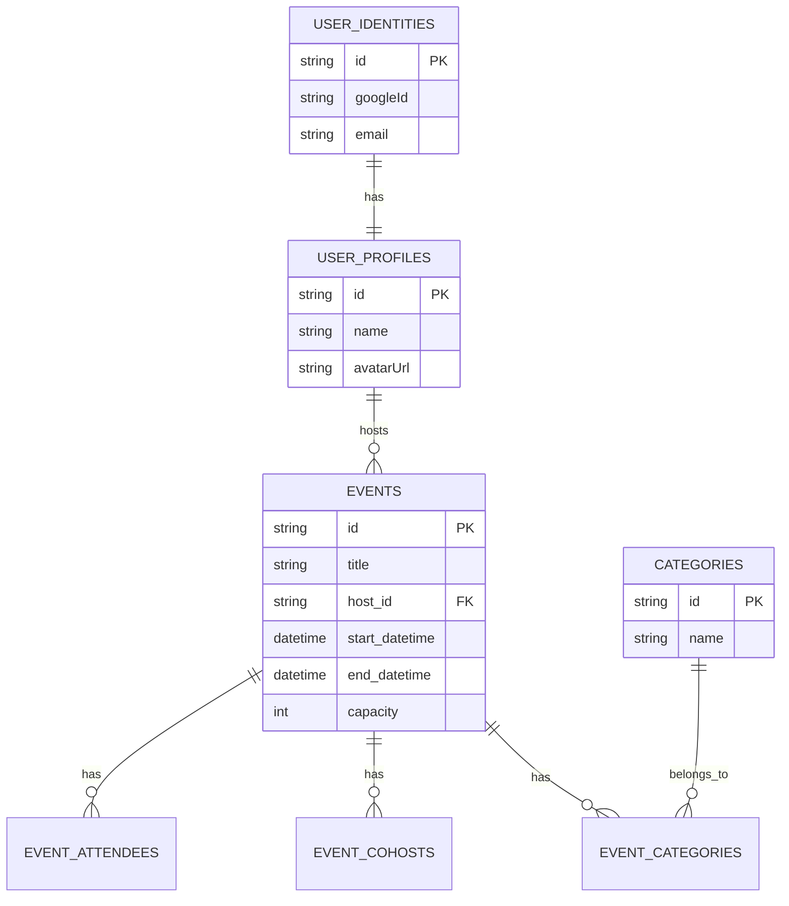

# VibeUp Backend Services

A robust, scalable REST API powering the VibeUp platform. Built with **Node.js**, **Express**, and **TypeScript** using **Domain-Driven Design (DDD)** principles.

## 🌐 Live Demo

- **Backend API**: [vibeup-backend.onrender.com](https://vibeup-backend.onrender.com)
- **Frontend**: [vibeup-frontend.vercel.app](https://vibeup-frontend.vercel.app)

---

## 🚀 Project Overview

**VibeUp** is an event discovery and social engagement platform. The backend is designed to handle complex business rules around event scheduling, user identities, and geographical data while maintaining high maintainability and testability.

### ✨ Features

**Authentication & Users**

- 🔐 Google OAuth 2.0 authentication
- 👤 User profile management (synced from Google)
- 🎫 JWT-based session management

**Event Management**

- 📅 Create, update, delete events
- 📍 Address with latitude/longitude coordinates
- 🏷️ Multi-category tagging
- 👥 Capacity limits and attendee tracking
- ✅ RSVP / Cancel RSVP functionality
- 👑 Host information with avatar

**Dashboard**

- 📊 User statistics (upcoming, attending, hosted)
- 📋 Filter events by category
- 🗓️ Attending and hosted event lists

**Categories**

- 🎵 15+ predefined categories (Music, Sports, Tech, Food, etc.)
- 🌱 Auto-seeded on startup

---

## 🗄️ Database

**PostgreSQL** with the following schema:

### Tables

- `user_identities` - Google OAuth user data
- `user_profiles` - User display info (name, avatar)
- `events` - Event core data
- `event_categories` - Event-to-category mapping (many-to-many)
- `event_attendees` - RSVP tracking
- `event_cohosts` - Co-host assignments
- `categories` - Event category definitions

### Migrations

- Auto-run on server startup via `sequelize.sync()`
- Schema changes tracked in domain models

### Seeders

- **Category Seeder**: Automatically seeds 15 categories on startup
- Located in `src/modules/category/infrastructure/seed/`

### ER Diagram

---

## � API Endpoints

### Authentication

| Method | Endpoint           | Description                          |
| ------ | ------------------ | ------------------------------------ |
| POST   | `/api/auth/google` | Authenticate with Google OAuth token |

### Users

| Method | Endpoint        | Description                            |
| ------ | --------------- | -------------------------------------- |
| GET    | `/api/users/me` | Get current authenticated user profile |

### Events

| Method | Endpoint               | Description                                 |
| ------ | ---------------------- | ------------------------------------------- |
| GET    | `/api/events`          | List all events                             |
| GET    | `/api/events/:id`      | Get single event by ID (includes host info) |
| POST   | `/api/events`          | Create new event (authenticated)            |
| PUT    | `/api/events/:id`      | Update event (host only)                    |
| DELETE | `/api/events/:id`      | Delete event (host only)                    |
| POST   | `/api/events/:id/rsvp` | RSVP to event (authenticated)               |
| DELETE | `/api/events/:id/rsvp` | Cancel RSVP (authenticated)                 |

### Dashboard

| Method | Endpoint                | Description                  |
| ------ | ----------------------- | ---------------------------- |
| GET    | `/api/events/stats`     | Get user dashboard stats     |
| GET    | `/api/events/attending` | Get events user is attending |
| GET    | `/api/events/hosted`    | Get events user is hosting   |

### Categories

| Method | Endpoint          | Description               |
| ------ | ----------------- | ------------------------- |
| GET    | `/api/categories` | List all event categories |

---

## �🛠️ Architecture Evolution

The backend architecture has evolved to meet increasing complexity requirements. This journey demonstrates a pragmatic approach to software design, starting simple and refactoring for scale.

### Phase 1: The "Simple MVC" Approach (MVP)

_Goal: Rapid Development & Prototyping_

Initially, the project followed a traditional **Model-View-Controller (MVC)** pattern.

- **Structure**:
  - `controllers/`: Handled HTTP requests and business logic.
  - `services/`: Contained some business logic but often mixed with database queries.
  - `models/`: Direct Sequelize models used everywhere.
- **Pros**: Fast to set up, easy to understand for small features.
- **Cons**: As the `User` and `Event` domains grew, controllers became bloated ("Fat Controllers"), and business rules were scattered across services and UI layers.

### Phase 2: Refactoring to Domain-Driven Design (DDD)

_Goal: maintainability, Testability & Separation of Concerns_

As the application matured, we transitioned to a **Clean Architecture / DDD** approach. This ensures that business rules are independent of external frameworks (like Express or Sequelize).

#### Current Structure Map

The module structure (e.g., `src/modules/user/`) is now strictly layered:

1.  **Domain Layer** (`/domain`)

    - _The Core_. Contains business entities and logic purely in TypeScript.
    - **Entities**: `UserAggregate.ts` (Rich domain model, distinct from DB tables).
    - **Rules**: Invariants and validation happen here.
    - **No Dependencies**: Does not know about specific databases or controllers.

2.  **Application Layer** (`/application`)

    - _The Orchestrator_. Handles specific use cases.
    - **Services**: `UserApplicationService.ts`. Coordinates Domain objects and Repositories.
    - **DTOs**: Defines how data enters/exits the system, decoupling internal models from API responses.

3.  **Infrastructure Layer** (`/infrastructure`)

    - _The Plumbing_. Connects to the outside world.
    - **Repositories**: `UserRepository.ts`. Implements Domain interfaces using Sequelize.
    - **Models**: `models/UserIdentity.model.ts`. Actual Database schemas (Sequelize).
    - **Mappers**: `UserMapper.ts`. Translates between DB Models <-> Domain Entities.

4.  **Presentation / UI Layer** (`/ui`)
    - _The Interface_.
    - **Controllers**: `user.controller.ts`. Minimal logic, just parses HTTP and calls Application Services.
    - **Routes**: `user.routes.ts`. Defines API endpoints.

---

## 💻 Tech Stack

- **Runtime**: Node.js
- **Language**: TypeScript (Strict mode)
- **Framework**: Express.js
- **Database**: PostgreSQL
- **ORM**: Sequelize (TypeScript)
- **Validation**: Joi / Domain-level validation
- **Testing**: Jest (Unit & Integration)

---

## 🔮 Future Improvements

- **Testing**: Increase unit test coverage to 80%+ with Jest
- **Caching**: Redis for frequently accessed data
- **CQRS**: Separate read/write operations for scalability
- **Monitoring**: Structured logging and error tracking (Sentry)
- **Security**: Rate limiting and security headers (Helmet.js)

---

## 🎨 Design Patterns

- **Repository Pattern**: Abstracts data access layer
- **Factory Pattern**: Event and User entity creation
- **Value Objects**: `Schedule`, `Location`, `EventCategory`
- **Aggregate Root**: `Event` entity with attendees and cohosts
- **Dependency Injection**: InversifyJS for IoC container

---

## 👤 Author

Built by **[Gergana Roshleva](https://github.com/GerganaR)**

---

_This architecture allows VibeUp to scale its complexity without accumulating technical debt, providing a solid foundation for future features like real-time chat and payment processing._
